When doing backend development, there's often a routine like this:

Call the Sign-up API → Log in and copy the token → Paste it into the header → Create content → Read → Update → Delete

You have 6 Postman tabs open, scrape the token from the response, and paste it into the header of the next request. Dozens of times a day. You only end up mastering the shortcut keys.

"Isn't there a way to create this flow once and run it with a single click?"

I started with that thought and built it myself.

---

## DecoyDuck — Node-based API Test Scenario Automation Tool

If you drag and drop nodes onto the canvas and connect them, that becomes your test scenario. From sign-up to token issuance, and resource CRUD — once you draw it out, the whole thing can be executed with a single button. You can use it right away on the web without signing up, and it's also available as a Windows app.

---

## Quick Start: Creating Your First Flow (3 minutes is enough)

### Step 1 — Add Nodes

Drag the desired nodes from the **Node Library** in the sidebar onto the canvas. You can create your first flow with just three nodes: Start, REST API, and End.

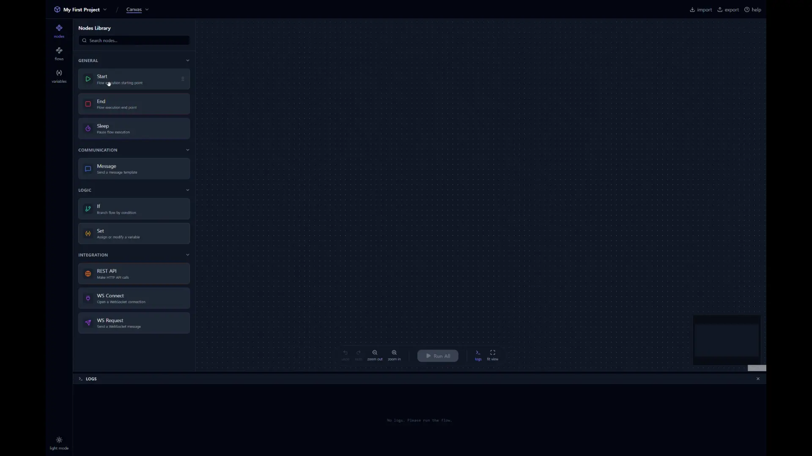

### Step 2 — Connect Edges

Drag from the handle (connection point) of one node to the handle of another node to complete the connection. This connection becomes the execution order.

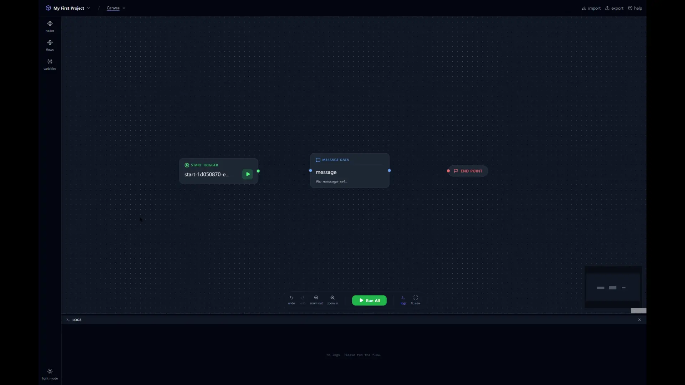

### Step 3 — Configure API

Click the REST API node to open the settings popover. Enter the URL, Method, Headers, Body, etc.

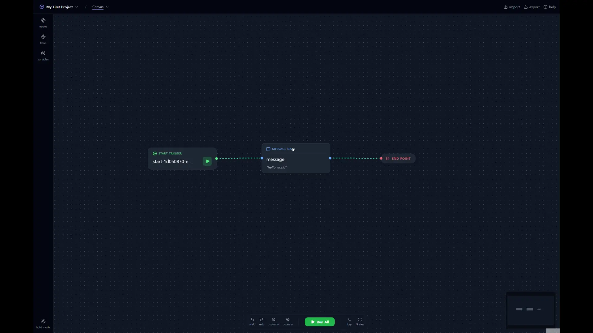

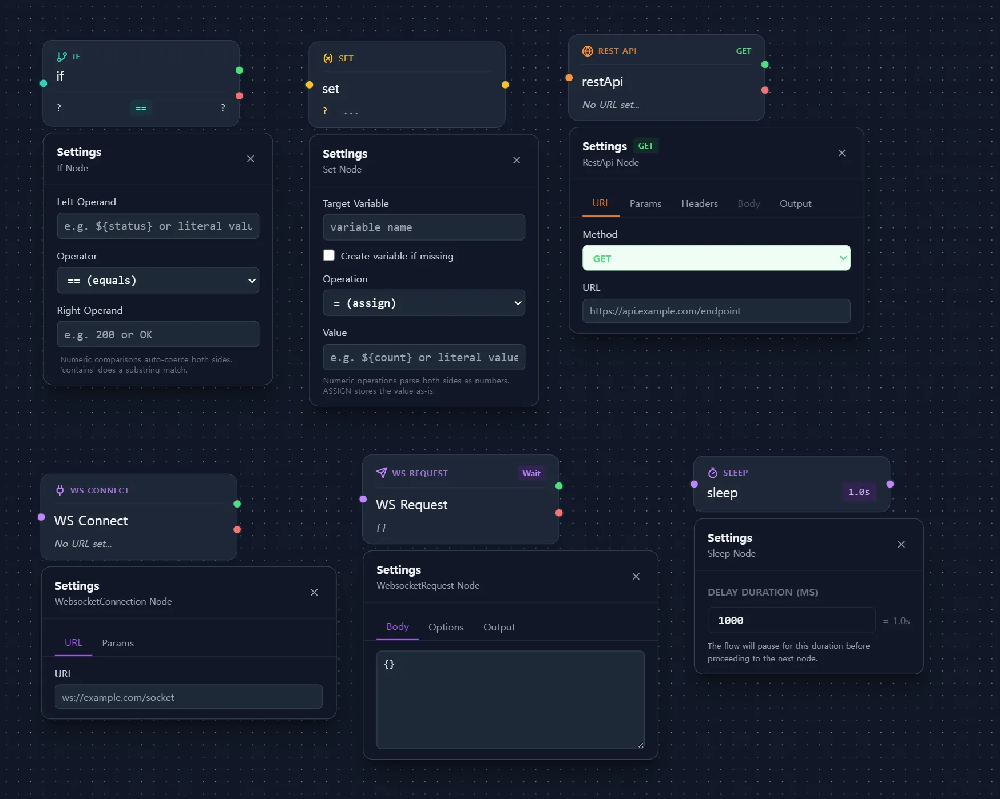

### Step 4 — Run & Check Response

Once you set up a GET request and run it, the response will be immediately displayed in the log panel. Try it once and you'll get the hang of it.

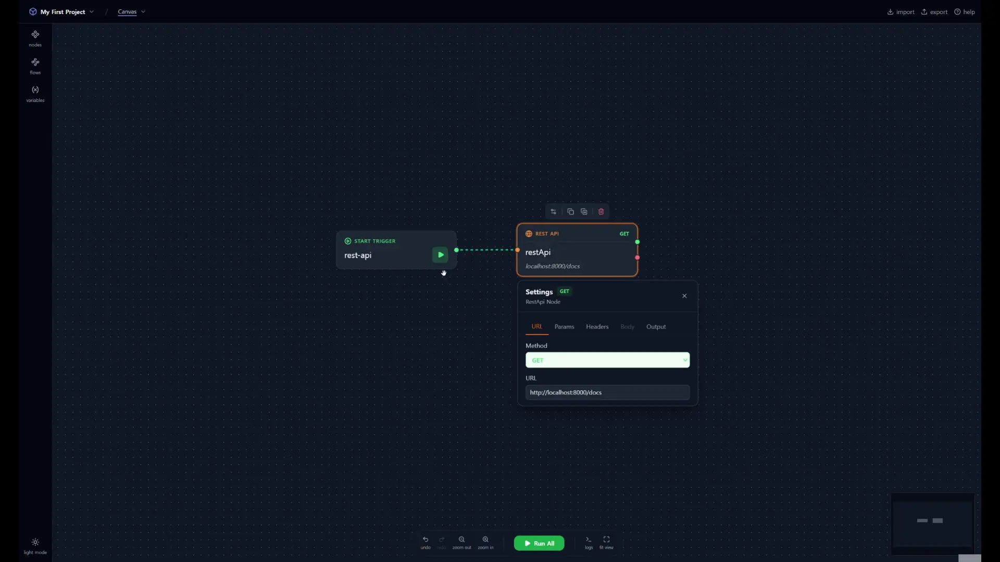

That's it. No complicated setups, just configure → connect → run.

---

## Core Feature Highlights

### POST Request & Body Settings

Not just GET, but also POST/PUT/DELETE. Put JSON in the Body and run it to see the response immediately.

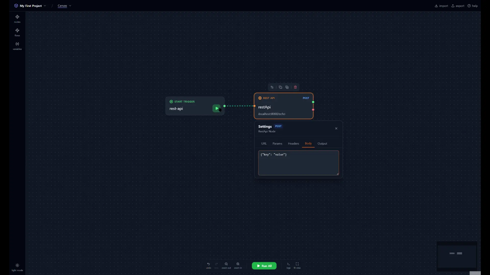

### Variable System

You can create variables and automatically save specific fields from API responses into them. In the next node, simply reference it as `${variable_name}`. Break free from the token copy-paste loop.

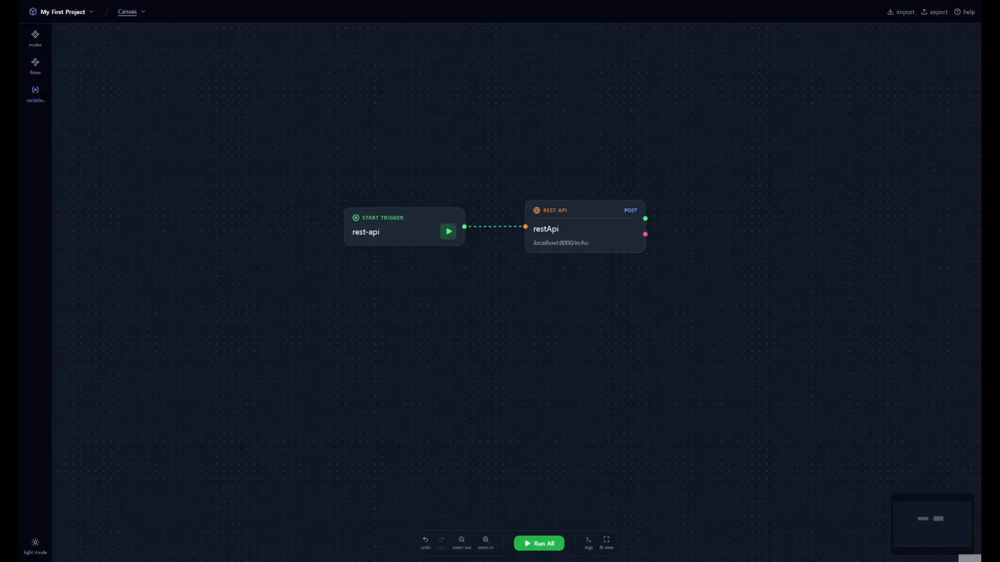

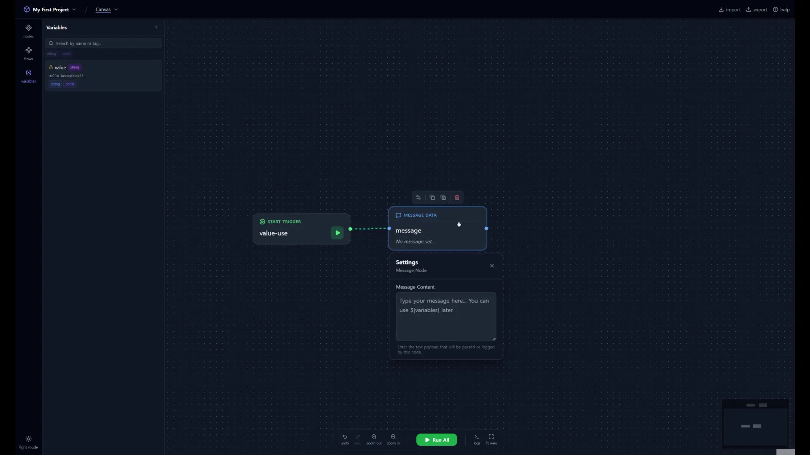

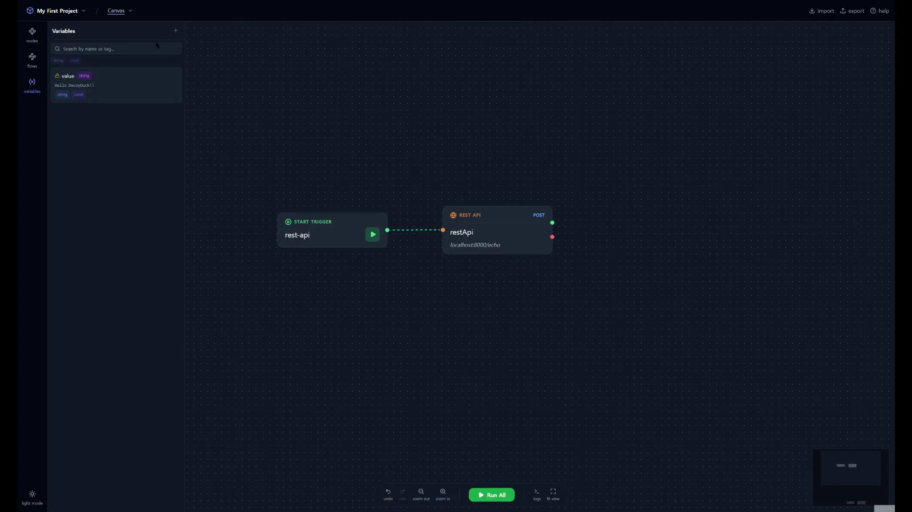

### Built-in Utility Functions

Easily use functions like `${$uuid()}` and `${$timestamp()}` with autocomplete. No need to look for a UUID generator every time.

### Node & Flow Cloning

Nodes and flows can be easily cloned with `Ctrl+C / Ctrl+V`. You can also duplicate an entire flow to quickly create variant scenarios.

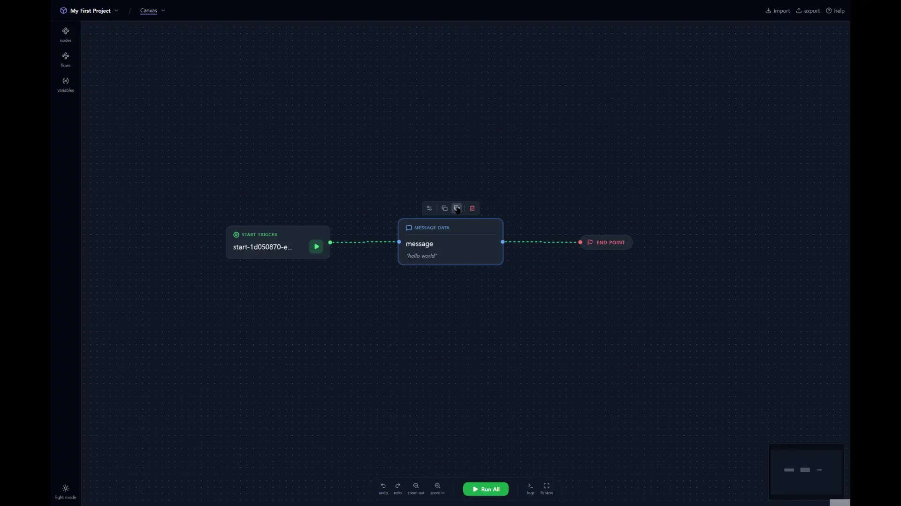

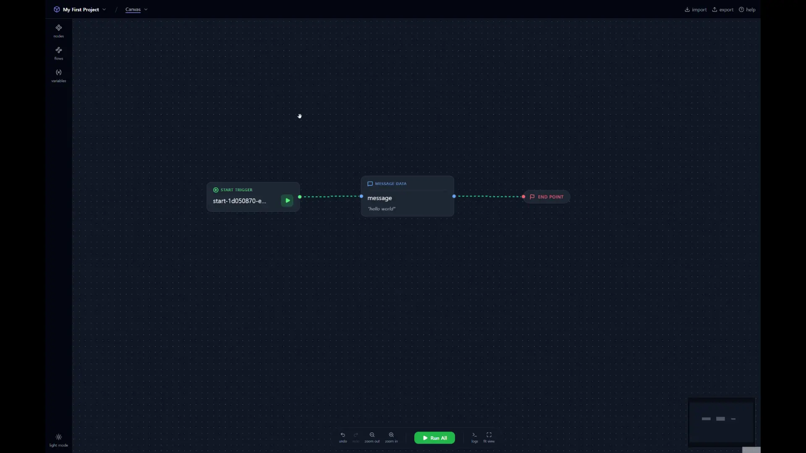

### Multi-Flows — Individual & Batch Execution

You can configure multiple scenarios on a single canvas. Run them individually from the Flows panel in the sidebar, or run them all at once with the **Run All** button in the bottom toolbar.

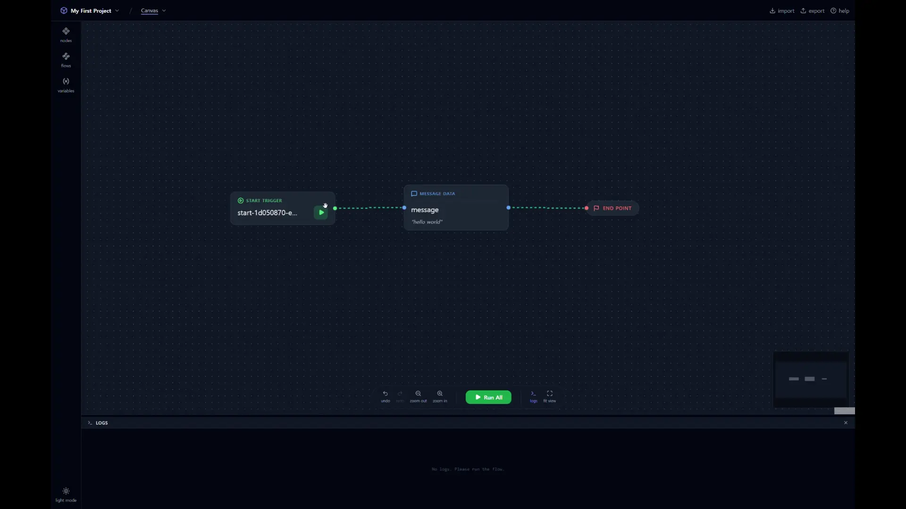

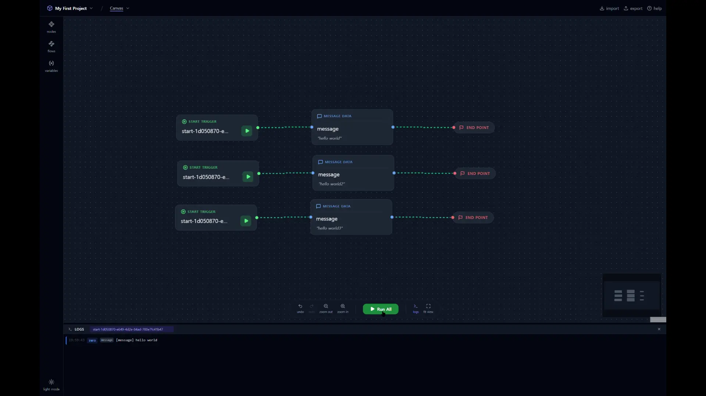

### If Node — Conditional Branching

Branch out to true/false paths based on conditions like `==`, `!=`, `>`, `<`. You can visually configure scenarios that perform different processing depending on the response status code.

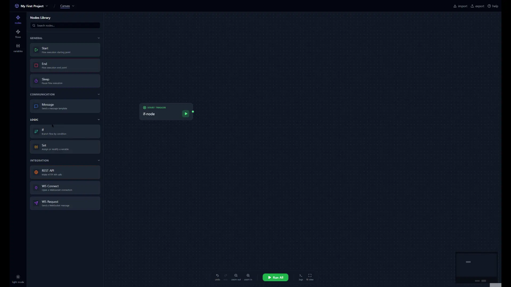

---

## Advanced Usage Preview

### Mixed WebSocket Flow

A scenario where you receive an authentication token via a REST API and use that token to connect to a WebSocket. Simply connect the **WS Connect → WS Request** nodes after the REST API node. Cross-protocol flows are completed on a single canvas.

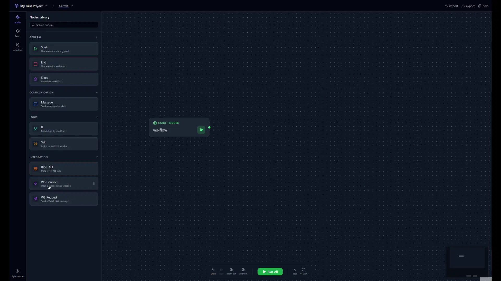

### Set+If Loop — Repetitive Execution Pattern

A structure where you increment a counter variable with a Set node, check the condition with an If node, and loop back. You can visually configure load testing simulations or retry logic.

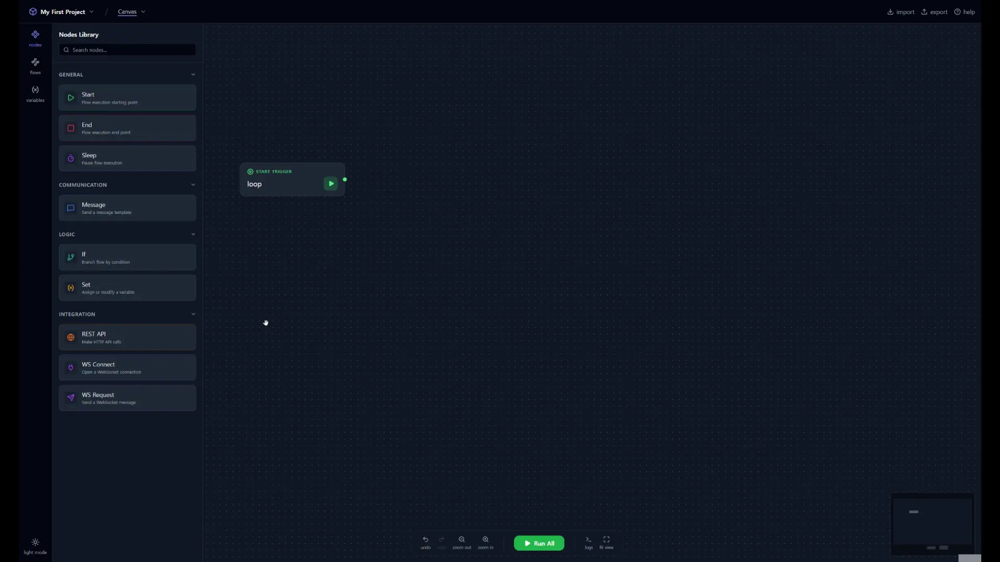

---

## How is it different from Postman?

| | **DecoyDuck** | **Postman** |
|---|---|---|
| **Scenario Configuration** | Visually connect nodes on a canvas | Sequential configuration in Collection Runner |
| **Flow Comprehension** | The entire flow is visible at a glance | Requires navigating settings as it gets complex |
| **Variable Passing** | Instant reference with `${variable_name}` + autocomplete | Requires environment variables + writing scripts |
| **REST + WebSocket** | Mixed usage in a single flow | Tested separately in different tabs |
| **Conditional Branching / Loop** | Visual configuration with If, Set nodes | Handled with Pre/Post request scripts |
| **Time to Get Started** | Instantly on the web without sign-up | Requires creating an account |
| **Price** | Free | Free (some features paid) |

It's not that Postman is a bad tool. It's just that for scenarios where you are "stringing together multiple APIs to test them in sequence", **drawing and connecting** can sometimes be more intuitive than writing scripts.

---

## Get Started Right Now

- **Use instantly on the web**: [https://decoyduck.rainshelter.net/](https://decoyduck.rainshelter.net/)
- **Windows App**: [Download from Microsoft Store](https://apps.microsoft.com/detail/9pnjgzm4c459)
- **GitHub Community**: [View on GitHub](https://github.com/studio-rainshelter/decoyduck-community)

You can try it out immediately without signing up or installing (web version). It only takes 3 minutes to create your first flow.

Since it's a personal side project, it might have some shortcomings, but feedback is always welcome.
